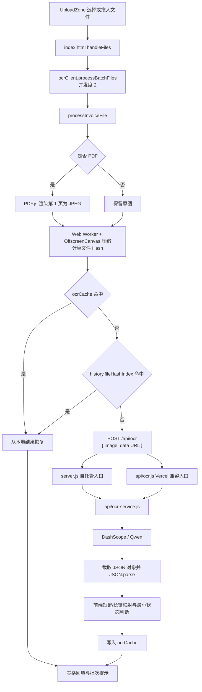

# Kairos-Finance 当前架构审计

> Phase 0 · 代码审计
> 审计日期：2026-07-05
> 审计对象：当前工作树，而非仅审计 `HEAD`

## 0. 审计范围与基线

本报告同时依据：

- 《黄鸟发票管理系统_技术升级与部署实施文档》v1.0（2026-07-04）
- 《黄鸟发票管理系统_UX设计与界面文案文档》v1.0（2026-07-04）
- 仓库 `AGENT.md` 中仍适用的架构边界与阅读顺序
- 当前工作树中的源代码、配置与测试

两份 DOCX 已完整提取段落与表格。文档均无内嵌图片；本机 LibreOffice 因缺少 `libfontconfig` 未能生成版面预览，但不影响本次以文字、表格为依据的架构审计。

审计时仓库基线为：

- 当前提交：`b2b0caf`
- 工作树已有多项未提交修改与未跟踪文件，包括 `api/ocr-service.js`、`server.js`、`tests/` 等。
- `AGENT.md` 本身也是未跟踪文件，且部分运行说明已经落后于当前工作树：它仍称只有 Vercel API、应使用 `vercel dev`、`package.json` 只有部署脚本；这些描述与当前 `server.js`、共享 OCR service 和新脚本不一致。因此本报告不把这些段落当作当前运行事实。
- 这些内容视为已有工作，只读审计；Phase 0 未修改任何运行代码。
- 本报告中的文件行号以 2026-07-05 当前工作树为准。

### 结论摘要

1. 本地优先主链仍成立：浏览器预处理、IndexedDB、同源 `/api/ocr`、本地 Excel、`print.html` 均仍在。
2. 当前唯一模型仍是硬编码的 `qwen-vl-max-latest`；目标三模型路由尚未实现。
3. `api/ocr.js` 与 `server.js` 已共用 `api/ocr-service.js`，但模型路由、结构校验、安全模块与脱敏日志尚未实现。
4. 当前前端已经有 `ready / needs_review / failed` 的内部状态雏形，但校验范围很窄，用户文案也未按 UX 文档统一。
5. OCR 缓存会保存模型与提示词版本，却不会在读取时校验版本，旧结果会长期命中。
6. 关键前端运行依赖仍来自未锁版本 CDN；打印页尤其依赖远程 Dexie。
7. 现有自动化测试在允许本机回环监听后为 15/15 通过，但没有覆盖真实 DashScope、Excel 文件内容、打印图片完成时机或浏览器交互。

## 1. 当前所有模型名出现位置

当前代码中唯一实际模型标识：

| 模型名 | 位置 | 用途 |
| --- | --- | --- |
| `qwen-vl-max-latest` | `api/ocr-service.js:1,101` | 服务端实际提交给 DashScope 的模型 |
| `qwen-vl-max-latest` | `js/utils/ocrClient.js:4,391-395` | 写入 IndexedDB OCR 缓存的模型版本元数据 |

以下目标模型和配置在当前代码、示例环境文件中均未出现：

- `QWEN_PRIMARY_MODEL=qwen3-vl-flash`
- `QWEN_FALLBACK_MODEL=qwen3.7-plus`
- `QWEN_HIGH_ACCURACY_MODEL=qwen3-vl-plus`
- `QWEN_ENABLE_THINKING=false`

补充：

- `index.html:727` 与 `js/components/SystemModals.js:201` 显示 “Powered by Qwen”，属于用户可见供应商文案，不是路由配置。
- `api/ocr-service.js:1` 和 `js/utils/ocrClient.js:4` 分别维护同一个硬编码值，存在服务端实际模型与前端缓存元数据漂移的风险。

## 2. DashScope endpoint 出现位置

唯一实际 endpoint 位于：

- `api/ocr-service.js:92-94`
- `https://dashscope.aliyuncs.com/api/v1/services/aigc/multimodal-generation/generation`

请求结构位于 `api/ocr-service.js:95-114`：

- `Authorization: Bearer <QWEN_API_KEY>`
- `Content-Type: application/json`
- 请求体包含 `model`、`input.messages[].content[].image` 和提示词

当前缺口：

- endpoint 硬编码，未读取 `QWEN_ENDPOINT`。
- 没有 `response_format` / JSON Mode。
- 没有显式 `enable_thinking`。
- 没有上游请求超时、重试或并发保护。

## 3. QWEN_API_KEY 读取方式

### 自托管 `server.js`

1. `server.js:34-67` 依次读取 `.env.local`、`.env`。
2. `server.js:28-32` 只在同名进程变量不存在时写入，因此优先级为：
   `进程环境变量 > .env.local > .env`。
3. `server.js:214-221` 在开始监听前调用环境文件加载器。
4. `api/ocr-service.js:79-89` 在每次识别调用时读取 `process.env.QWEN_API_KEY`；缺失即抛错。
5. `api/ocr-service.js:96-99` 将密钥作为发往 DashScope 的 Bearer Token。

### Vercel 兼容入口 `api/ocr.js`

- `api/ocr.js:18` 调用同一 OCR service。
- 入口本身不加载本地环境文件，由运行平台向 `process.env` 注入 `QWEN_API_KEY`。

### 安全观察

- 当前浏览器代码没有读取或包含 `QWEN_API_KEY`，密钥仍留在服务端。
- 本次审计未输出 `.env` 或 `.env.local` 的值，只确认变量名与读取路径。
- 当前两种入口都会把 `error.message` 放进 500 响应的 `details`，可能把内部配置错误直接传到浏览器：`api/ocr.js:20-25`、`server.js:168-177`。

## 4. `/api/ocr` 前后端完整调用链路

精确调用点：

1. 文件输入：`js/components/UploadZone.js:19-31`。主上传 input 当前没有 `accept` 限制。
2. 批量入口与队列回调：`index.html:418-496`。
3. 并发编排：`js/utils/ocrClient.js:407-440`，并发度固定为 2。
4. 单文件主流程：`js/utils/ocrClient.js:306-405`。
5. PDF 首页转图：`js/utils/imageProcessor.js:156-193`。
6. 压缩与 Hash：`js/utils/imageProcessor.js:137-149,211-238`。
7. `ocrCache` 命中：`js/utils/ocrClient.js:331-339`。
8. 历史记录回退：`js/utils/ocrClient.js:341-360`。
9. 60 秒浏览器超时与 POST：`js/utils/ocrClient.js:362-378`。
10. 自托管路由：`server.js:146-183,189-203`。
11. Vercel 路由：`api/ocr.js:6-25`。
12. DashScope 请求与解析：`api/ocr-service.js:52-76,79-124`。
13. 前端字段映射与状态生成：`js/utils/ocrClient.js:7-24,72-89,223-260`。
14. 缓存写入：`js/utils/ocrClient.js:386-398`。
15. 表格流式回填：`index.html:449-480`。

单条主图重新上传通过 `index.html:546-580` 进入同一 `processInvoiceFile`。`analyzeInvoiceImage` 是兼容包装器，当前主 UI 不直接调用。

## 5. IndexedDB stores 与缓存逻辑

数据库名为 `KairosDB`，当前 schema 版本为 v5：

| Store | 主键 / 索引 | 当前用途 | 证据 |
| --- | --- | --- | --- |
| `drafts` | `++id, timestamp` | 固定 `id=1` 保存当前工作区草稿 | `storageRepository.js:15-18,184-203` |
| `history` | `++id, timestamp, total, count, fileHashIndex` | 归档报销快照、历史列表、Hash 回退 | `storageRepository.js:20-22,219-278` |
| `templates` | `++id, timestamp, name` | 仅定义，当前未见读写 | `storageRepository.js:24-26,32-38` |
| `printJobs` | `++id, timestamp` | 跨窗口传递打印 payload | `storageRepository.js:28-38,300-323` |
| `ocrCache` | `fileHash, updatedAt, modelVersion, promptVersion` | 以文件 Hash 为主键保存 OCR 字段 | `storageRepository.js:32-38,325-349` |

`print.html:249-264` 会重复声明同一套 v1-v5 schema，以便在独立页面读取 `printJobs`。

### 草稿与历史

- 当前内容变化后延迟 2 秒自动保存：`index.html:284-296`。
- 页面启动时读取固定草稿并提示恢复：`index.html:298-338`。
- Blob URL 在落库前会压缩或转 data URL，`file` 字段会被删除：`storageRepository.js:95-177`。
- 历史记录保存处理后的 items、报销信息和列快照：`storageRepository.js:219-258`。
- 历史记录超过 30 天会清理：`storageRepository.js:352-357`。
- `printJobs` 每次写入前删除超过 1 小时的任务：`storageRepository.js:300-315`。

### OCR 缓存顺序

1. 计算当前待识别文件的 Hash。
2. 先查询 `ocrCache[fileHash]`。
3. 未命中后查询 `history.fileHashIndex`。
4. 两者均未命中才请求网络。
5. 网络返回并完成前端字段映射后写入 `ocrCache`。

### 当前缓存风险

- 读取时不校验 `updatedAt`、`modelVersion` 或 `promptVersion`：`ocrClient.js:331-339`。旧模型结果会无限期绕过新识别。
- 缺日期、缺金额或其他低质量结果也会写入缓存：`ocrClient.js:386-398`。
- 当前两个归档调用都没有传入 `archiveToHistory` 的第 4 个 `fileHash` 参数，`history.fileHashIndex` 通常为空：`index.html:347-350`、`exportManager.js:346-349`。
- 即使历史 Hash 可用，命中后只恢复记录中的第一个条目：`ocrClient.js:341-344`，批量归档可能恢复错行。
- SparkMD5 加载失败或文件读取失败时使用含当前时间的临时 Hash，无法稳定命中：`imageProcessor.js:137-149`。
- PDF 的 Hash 基于转换后的第一页 JPEG，而不是原 PDF 全文件：`ocrClient.js:314-324`。
- `ocrCache` 当前没有清理或失效策略。

## 6. ExcelJS 导出链路

调用链：

1. 表格操作区打开导出预览：`js/components/ReimbursementTable.js:512-518`。
2. `index.html:758-768` 将当前工作区或历史快照传给 `ExportPreviewModal`。
3. Excel 按钮调用 `window.exportToExcel(...)`：`ExportPreviewModal.js:294-301`。
4. `index.html:38-39` 加载本地 `/libs/exceljs.min.js`。
5. `exportManager.js:15-25` 创建 workbook 和“报销单”worksheet，并过滤隐藏列与 `actions`。
6. `exportManager.js:77-158` 并行处理发票图、订单图、支付凭证和附件。
7. `exportManager.js:162-252` 写入数据行、图片、样式和合计。
8. `exportManager.js:254-261` 调用 `workbook.xlsx.writeBuffer()`，生成 Blob 与下载链接。

当前风险：

- Worker 固定输出 JPEG：`imageWorker.js:72-89`；Excel 却以 `extension: 'png'` 注册图片：`exportManager.js:198-202,215-219`。
- Worker 不可用时主线程回退尚未实现，直接返回 `null`：`imageProcessor.js:69-74,120-130`，导出可能静默缺图。
- 下载完成后没有 `URL.revokeObjectURL()`：`exportManager.js:255-261`。
- 合计值固定放在最后一个可见列，并不定位金额列：`exportManager.js:240-252`。
- `exportToExcel` 支持进度回调，但模态框调用时没有传入，用户看不到实际进度：`ExportPreviewModal.js:296`。
- 当前自动化测试没有打开并验证生成的 `.xlsx`。

## 7. `print.html` 打印链路

调用链：

1. `ExportPreviewModal.js:302-309` 调用 `window.exportToPrint(...)`。
2. `exportManager.js:277-295` 立即打开空白窗口，降低弹窗拦截概率。
3. `exportManager.js:297-344` 将 Blob URL 转为实际 Blob，构造打印 payload。
4. `exportManager.js:346-349` 在后台触发历史归档。
5. `exportManager.js:351-355` 优先写入 IndexedDB `printJobs`，再跳转 `print.html?jobId=...`。
6. `print.html:266-283` 从 URL 读取 `jobId` 并查询 `KairosDB.printJobs`。
7. 无记录或无 `jobId` 时读取 `localStorage.printData`：`print.html:286-298`。
8. `print.html:305-419` 渲染基础信息、列、图片、金额和总计。
9. `print.html:421-439` 页面 load 后固定等待 800ms，再调用 `window.print()`。

当前风险：

- `savePrintJob()` 存在但 IndexedDB 写入失败时，外层直接关闭窗口，不会回退到 localStorage：`exportManager.js:351-365`。
- localStorage 路径会对含 Blob 的 payload 执行 `JSON.stringify`，图片内容可能丢失：`exportManager.js:300-338,357`。
- `printData` 不会清理，缺少 `jobId` 时可能读取旧任务。
- IndexedDB 路径没有校验 payload 结构；结构校验只覆盖 localStorage：`print.html:277-298`。
- 打印页依赖未锁版本的远程 Dexie：`print.html:249-250`；断网时无法读取打印任务。
- 固定等待 800ms，没有等待所有图片完成加载：`print.html:421-439`。
- `ensureBlob('previewUrl', ...)` 与 `ensureBlob('orderImage', ...)` 各重复执行一次：`exportManager.js:330-335`。
- 打印 payload 只过滤 `visible`，没有排除 `actions`：`exportManager.js:340-344`。
- 打印触发的历史归档没有传列配置：`exportManager.js:346-349`。

## 8. CDN 依赖

### 外部依赖

| 依赖 | 位置 | 锁定情况 | 作用与风险 |
| --- | --- | --- | --- |
| Google Fonts | `index.html:11-15` | 字体 URL 固定 | Noto Sans SC / Plus Jakarta Sans；失败时回退字体 |
| React | `index.html:18` | 仅 `@18` | React UMD；未锁 patch |
| ReactDOM | `index.html:19` | 仅 `@18` | ReactDOM UMD；未锁 patch |
| Babel Standalone | `index.html:20` | 未锁版本 | 浏览器运行时转换 `text/babel`，属于启动关键路径 |
| Tailwind CDN | `index.html:23` | 未锁版本 | 运行时样式关键路径 |
| Lucide | `index.html:26` | `@latest` | 未发现 `data-lucide`，可能是遗留依赖 |
| Dexie | `index.html:42`、`print.html:250` | 未锁版本 | IndexedDB 与打印关键路径；断网会阻断本地功能 |
| Spark-MD5 | `index.html:44` | `3.0.2` | 文件 Hash；唯一明确锁版本的 CDN 脚本 |

上述脚本均未设置 SRI。当前 `package.json` 没有 `dependencies` 或锁文件。

### 已本地化依赖

| 依赖 | 位置 | 当前用途 |
| --- | --- | --- |
| html2pdf.js | `/libs/html2pdf.bundle.min.js` | 已加载，但当前打印主链未调用，疑似遗留 |
| PDF.js | `/libs/pdf.min.js`、`/libs/pdf.worker.min.js` | PDF 首页转图 |
| PDF CMaps | `/libs/cmaps/` | PDF 字符映射 |
| ExcelJS | `/libs/exceljs.min.js` | 浏览器本地生成 Excel |

## 9. Vercel `api/ocr.js` 与 `server.js` 差异

| 项目 | `api/ocr.js` | `server.js` |
| --- | --- | --- |
| 运行形态 | Vercel Serverless handler | 原生 Node HTTP 服务 |
| 静态资源 | 不负责 | 同时提供整个静态站点 |
| OCR 方法 | 仅 POST | OPTIONS 204 + POST |
| 请求体解析 | 依赖平台预解析 `req.body` | 自行流式读取并 `JSON.parse` |
| 请求体限制 | 文件内无显式限制 | 默认 15 MiB，超限返回 413 |
| 非法 JSON | 依赖平台行为 | 明确返回 400 |
| 环境文件 | 不加载 | 加载 `.env.local`、`.env` |
| 健康检查 | 无 | 当前路径是 `/health` 且未限制请求方法，不是目标 `GET /api/health` |
| 错误状态 | OCR 异常统一 500 | 请求解析可返回 400/413，OCR 异常为 500 |
| 测试注入 | 无 | `createAppServer` 可注入 `ocrService` |
| OCR 核心 | 共用 `api/ocr-service.js` | 共用 `api/ocr-service.js` |

共同缺口：

- 未校验 `Authorization: Bearer <OCR_ACCESS_TOKEN>`。
- 未强制 `Content-Type: application/json`。
- 未限制图片为 `data:image/jpeg` 或 `data:image/png`。
- 未生成 `requestId`，没有结构化脱敏日志。
- 未实现模式参数、模型路由、自动复查、结构校验或技术 `meta`。
- 都会把服务端异常详情返回浏览器。

自托管附加观察：

- `startServer` 的 `port` / `host` 默认参数在 `loadEnvFiles()` 之前求值：`server.js:214-221`。仅写在 `.env` 中的 `PORT` / `HOST` 可能不会影响本次启动；进程环境变量不受此问题影响。

## 10. 当前最容易导致识别失败的原因

| 优先级 | 原因 | 当前影响 | 证据 |
| --- | --- | --- | --- |
| P0 | `QWEN_API_KEY` 缺失、失效或无权限 | 全部网络识别返回 500 | `ocr-service.js:79-89` |
| P0 | 单一旧模型硬编码，无重试、自动复查或增强识别 | 模型、限流、网络或结果异常会直接失败 | `ocr-service.js:1,79-124` |
| P0 | 输出协议脆弱 | 固定读取 `content[0]`，从首个 `{` 截到最后一个 `}`；畸形、多对象或非 JSON 响应直接失败 | `ocr-service.js:52-76,117-124` |
| P0 | 没有 JSON Mode、thinking 配置或服务端结构校验 | 可解析但错误/缺字段的结果仍会进入前端和缓存 | `ocr-service.js:100-113`、`ocrClient.js:386-398` |
| P1 | Worker / OffscreenCanvas 失效时主线程回退为空 | 图片尚未发给服务端就失败 | `imageProcessor.js:69-74,120-130` |
| P1 | 浏览器固定 60 秒超时，服务端无对应取消 | 客户端判失败后，上游请求仍可能继续占用资源 | `ocrClient.js:362-378` |
| P1 | PDF 只识别第一页，图片二次降采样最低到 1080 / 0.55 | 多页或小字票据丢字段 | `imageProcessor.js:14-23,156-188,229-231` |
| P1 | 上传入口没有严格限制 JPG / PNG / PDF | 主上传 input 无 `accept`；除 PDF 外均按图片处理，任意文件或 HEIC 可能进入 `createImageBitmap` 后失败 | `UploadZone.js:19-31`、`ocrClient.js:411-426`、`ReimbursementTable.js:94-100,158-163` |
| P1 | “已完成”判断过窄 | 只检查日期、金额、摘要；不检查发票号、日期格式、税额或金额关系 | `ocrClient.js:72-89` |
| P1 | 摘要缺失时用文件名补位 | 可能把缺少摘要的结果错误判为可用 | `ocrClient.js:232-239` |
| P2 | 缓存不校验模型/提示词版本 | 旧模型或低质量结果持续绕过网络 | `ocrClient.js:331-339`、`storageRepository.js:325-349` |
| P2 | 启动依赖多个未锁 CDN | CDN、网络或上游版本变化可使预处理、缓存或 UI 先于 OCR 失败 | `index.html:18-44` |

自动化测试的边界：

- 允许本机回环监听后，`npm test` 为 15/15 通过。
- 测试覆盖短键映射、缓存优先、基础状态、基础自托管路由与 UI 静态约束。
- 未覆盖真实 DashScope 调用、模型切换、上游超时/非 JSON、自动复查、访问凭证、Excel 内容、打印图片完成时机或真实发票样本。

## 11. 当前界面中不够用户化或暴露工程术语的文案

### 状态语言

| 内部状态 / 场景 | 当前文案与位置 | 问题 | 目标文案 |
| --- | --- | --- | --- |
| `ready` | “就绪”：`ReimbursementTable.js:83`、`ExportPreviewModal.js:112`；“已就绪”：`ocrClient.js:95-98` | 与 UX 文档不一致，容易暗示系统判定 | “已完成” |
| `needs_review` | “待检查”：`ReimbursementTable.js:82`、`ExportPreviewModal.js:115,278` | 语气偏任务指令 | “建议检查” |
| `failed` | “失败”：`UploadZone.js:62`、`ReimbursementTable.js:84`、`ExportPreviewModal.js:118,278` | 未说明识别失败，也没有恢复闭环 | “识别失败” + “重新识别 / 增强识别 / 手动填写” |
| `cached` | “命中缓存并快速回填”：`index.html:479-480,566-567` | 直接暴露缓存概念 | “已从本地记录恢复” |
| `fallback` | 当前没有分支或文案 | 自动复查尚未实现 | “系统已自动再识别一次” |
| `high_accuracy` | 当前没有入口或文案 | 手动增强尚未实现 | “增强识别” |
| `processing` | “处理中...”：`UploadZone.js:60` | 不知道在准备图片还是识别 | “正在准备图片” / “正在识别发票” |
| `queued` | “等待中”：`UploadZone.js:59` | 状态过泛 | “等待识别” |

### 工程词与供应商信息

- “Powered by Qwen”：`index.html:727`、`SystemModals.js:201`。
- “OCR 自动识别”：`SystemModals.js:37`。
- “OCR 失败”：`ExportPreviewModal.js:19`、`ocrClient.js:47-52`、`index.html:576`。
- “ExcelJS 库未加载”：`exportManager.js:16-17`。
- 版本弹窗直接显示 “Dexie.js / IndexedDB / OffscreenCanvas / CMaps / Web Worker”：`data/version.json:7-11`，渲染位置 `VersionModal.js:39-43`。
- “Popup Blocker”：`exportManager.js:281`。
- 内部错误会经 `index.html:483-485`、`ocrClient.js:458-472` 原样进入 toast、摘要说明、表格和导出；可能间接暴露 `DashScope`、`QWEN_API_KEY`、`JSON`、`libs/cmaps` 或 HTTP 状态。

### 不够用户化的后台式文案

- “AUTO SAVE / SAVING... / READY”：`AppHeader.js:13-25`。
- “REIMBURSEMENT INFO / CLEAN / SAVE”：`ReimbursementInfo.js:16,33,39`。
- “QUICK START GUIDE / UNSAVED DRAFT FOUND / Draft / Processing Request”：`SystemModals.js:17,82,122,244`。
- “VERSION RECORDS / [ CLEAR ALL ] / AUTO-CLEANUP: 30 DAYS”：`HistorySidebar.js:72,201,204`。
- “Whats New”：`VersionModal.js:20-22`。
- “(Max 10)”：`UploadZone.js:31`。
- 上传区声称仅支持 JPG、PNG、PDF，但主文件 input 没有格式限制：`UploadZone.js:19-31`；代码与界面承诺不一致。
- 自动识别确认只使用“是 / 否”：`SystemModals.js:200-223`，没有说明两个动作的后果。
- 版本说明中的“只要浏览器不炸”“完美解决”不够稳健：`data/version.json:6,10`。

### 缺少下一步操作的错误

- “无可保存内容”：`index.html:343`，未提示先填写或上传。
- 批量失败直接拼接内部错误：`index.html:483-485`，未提示重试、分批或手动填写。
- 单条识别失败只提示保留手工补充：`index.html:576`，缺少重新识别和增强识别。
- 失败行当前只有展开/删除，没有三项恢复入口：`ReimbursementTable.js:424-439`。
- 导出检查清单只能查看，不能定位或恢复：`ExportPreviewModal.js:263-281`。
- 图片加载失败直接显示源地址或 “Invalid Source Type”：`ImagePreviewModal.js:67-73`。
- 打印“数据格式不正确”没有引导返回主页面重新导出：`print.html:294-301,441-445`。
- ExcelJS 加载失败没有建议刷新、检查网络或改用打印：`exportManager.js:16-17`。

已有合格示例：

- 超过 10 个文件时提示“请分批上传”：`index.html:418-423`。
- 打印任务不存在时提示“请从主页面重新导出”：`print.html:286-291`。

## Phase 0 结论

当前架构仍适合按“本地优先 + 同源薄代理 + 本地导出”方向升级，不需要 PostgreSQL、对象存储、用户系统或 Next.js。后续应保持小步顺序：

1. Phase 1 先把模型、endpoint、thinking 与模式选择集中到服务端，并保留现有 `api/ocr.js` / `server.js` 双入口；先覆盖请求失败和解析失败的自动复查，并预留正式校验触发接口。
2. Phase 2 再把短长键映射和完整字段校验集中到服务端，并接通“校验失败自动复查”；阶段依赖见 `docs/open-questions.md`。
3. Phase 3 补访问控制、输入限制和脱敏日志；凭证交付方式见 `docs/open-questions.md`。
4. Phase 4 才正式使用 Web/React/Building Components skills 做文案与组件小步重构。
5. IndexedDB、PDF.js、Worker + OffscreenCanvas、ExcelJS、`print.html` 与 OCR 缓存主链必须保留，并为现有数据提供兼容逻辑。

本阶段没有修复上述问题，也没有修改运行代码。
