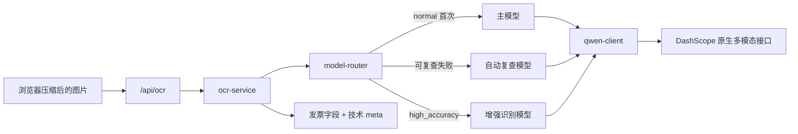

# Phase 1 模型路由设计

**日期：** 2026-07-05
**状态：** 已确认方向，等待测试先行实施
**适用阶段：** Phase 1 - AI 模型路由

## 1. 目标

在不改变 Kairos-Finance 本地优先架构的前提下，把单一旧模型调用拆为“标准识别、自动复查、增强识别”三条服务端路由：

- `normal` 先使用主模型；可复查失败时使用同一张压缩图片自动再识别一次。
- `high_accuracy` 直接使用增强识别模型，不再串联自动复查。
- 所有模型名只从环境变量读取，JavaScript 源码不包含具体模型名。
- 使用 DashScope 原生多模态协议、JSON Mode，并显式关闭 thinking。
- 保留浏览器本地预处理、IndexedDB OCR 缓存、Vercel 兼容入口和自托管入口。

## 2. 已核实的外部能力

- `qwen3-vl-flash`、`qwen3-vl-plus` 和 `qwen3.7-plus` 都支持图像输入；自动复查可以重新读取原始压缩图片，而不是只修补首轮文本。
- 三者都可使用 DashScope 原生 `multimodal-generation/generation` 协议。
- 非思考模式支持 `response_format: { "type": "json_object" }`；提示词仍需明确要求 JSON。
- `qwen3.7-plus` 可能默认启用 thinking，thinking 与 JSON Mode 不兼容，因此请求必须显式发送 `enable_thinking: false`。

官方依据：

- <https://help.aliyun.com/zh/model-studio/vision-model>
- <https://help.aliyun.com/zh/model-studio/vision>
- <https://help.aliyun.com/zh/model-studio/qwen-api-via-dashscope>
- <https://help.aliyun.com/zh/model-studio/qwen-structured-output>

## 3. 协议选择

采用现有 DashScope 原生多模态接口，不在 Phase 1 切换到 OpenAI-compatible 协议。

理由：

1. 当前 `api/ocr-service.js` 已使用原生协议，继续沿用能减少请求体、响应解析和部署配置同时变化的风险。
2. 官方资料确认三个目标模型均可走该协议，不需要为自动复查维护第二套客户端。
3. Endpoint 改由 `QWEN_ENDPOINT` 配置后，后续切换工作空间专属域名不需要再改业务代码。

## 4. 模块职责



### `api/qwen-client.js`

- 读取 `QWEN_API_KEY`、`QWEN_ENDPOINT`、`QWEN_ENABLE_THINKING`、`QWEN_TIMEOUT_MS`、`QWEN_MAX_RETRIES`。
- 接收路由器传入的模型名、图片和提示词。
- 构造原生多模态请求，并在 `parameters` 中发送：
  - `result_format: "message"`
  - `enable_thinking: false`
  - `response_format: { type: "json_object" }`
- 每个模型调用共享一个 `QWEN_TIMEOUT_MS` 总预算；在预算内，仅对网络错误、429、408 和 5xx 最多重试 `QWEN_MAX_RETRIES` 次。
- 错误对象只包含错误类型、HTTP 状态和安全摘要，不保存请求体、图片或 base64。

### `api/model-router.js`

- 只从 `QWEN_PRIMARY_MODEL`、`QWEN_FALLBACK_MODEL`、`QWEN_HIGH_ACCURACY_MODEL` 读取模型名。
- 三个变量缺少任意一个时返回配置错误，不在源码内回退到具体模型字符串。
- `normal`：主模型成功且通过当前验证函数时直接返回；可复查失败时调用自动复查模型。
- `high_accuracy`：只调用增强识别模型。
- 接受可注入的 `validateResult(result)`；Phase 1 默认只要求结果能解析为对象，Phase 2 注入正式业务校验。
- 统计从路由开始到最终结果的总耗时，返回 `model`、`fallbackUsed` 和 `latencyMs`。

### `api/ocr-service.js`

- 保留短键 OCR 提示词和兼容性 JSON 提取。
- 首次识别和增强识别使用标准提示词。
- 自动复查使用“重新独立查看原图并重点核对关键财务字段”的提示，不携带首轮模型原文。
- 串联 qwen client、model router 和 JSON 解析。
- Phase 1 返回根级发票字段并附加 `meta`，避免提前破坏当前前端：

```json
{
  "d": "2026-07-05",
  "n": "12345678",
  "t": 106,
  "meta": {
    "model": "<实际使用的环境变量值>",
    "fallbackUsed": false,
    "latencyMs": 3210
  }
}
```

Phase 2 再引入正式的 `status`、`data`、`warnings` 响应结构；Phase 1 不伪造 Schema 验收结果。

### 两个 HTTP 入口

- `api/ocr.js` 和 `server.js` 都从请求体读取 `mode`，缺省为 `normal`。
- 两个入口都把 `image` 和 `mode` 交给同一个 `recognizeInvoiceFromImage`。
- 不在本阶段引入 Token 校验或统一日志模块；这些属于 Phase 3。

### 浏览器兼容层

- 默认请求显式发送 `mode: "normal"`，为 Phase 4 的“增强识别”入口预留调用能力。
- OCR 缓存的 `modelVersion` 改用服务端返回的 `meta.model`，移除浏览器中的旧模型硬编码。
- `meta` 只用于内部状态和缓存，不直接渲染到界面。
- 浏览器等待时间覆盖“主识别 + 自动复查”的服务端预算，避免第二次识别进行中被旧的 60 秒前端定时器提前中断。

## 5. 自动复查规则

以下情况允许从主模型转到自动复查模型：

- 网络连接错误或超时。
- 408、429 或 5xx 上游错误。
- 上游响应无法读取或不包含可解析 JSON 对象。
- 注入的验证函数返回失败；Phase 2 将在这里接入字段与金额关系校验。

以下情况不自动复查：

- 缺少 API Key、Endpoint 或任一模型环境变量。
- `mode` 非法。
- DashScope 返回 400、401 或 403 等配置、请求或权限错误。
- 输入图片缺失。

这样可以避免用第二个模型重复提交一个必然失败的配置或鉴权请求。

## 6. 环境变量

`.env.production.example` 是生产默认值的单一示例来源，运行时代码只读取环境变量：

```dotenv
NODE_ENV=production
HOST=0.0.0.0
PORT=3000
QWEN_API_KEY=replace-with-dashscope-api-key
QWEN_ENDPOINT=https://dashscope.aliyuncs.com/api/v1/services/aigc/multimodal-generation/generation
QWEN_PRIMARY_MODEL=qwen3-vl-flash
QWEN_FALLBACK_MODEL=qwen3.7-plus
QWEN_HIGH_ACCURACY_MODEL=qwen3-vl-plus
QWEN_ENABLE_THINKING=false
QWEN_TIMEOUT_MS=60000
QWEN_MAX_RETRIES=1
```

`.env.example` 同步这些键，供本地自托管运行使用；真实密钥不进入仓库。

## 7. Phase 1 / Phase 2 边界

Phase 1 完成：

- 模型环境配置和三路选择。
- 请求、超时、上游错误和 JSON 解析失败时自动复查。
- 可注入验证失败触发机制及单元测试。
- 技术 `meta`。

Phase 2 完成：

- 短键和长键统一映射。
- 日期、发票号、金额、税额、总额校验。
- `warnings` 和 `ready / needs_review / failed`。
- 将正式业务校验注入 Phase 1 路由，完成“字段校验失败自动复查”的端到端验收。

## 8. 线程与提交策略

- 幕僚长线程维护设计、阶段边界、验收与最终提交。
- Phase 1 业务代码由独立执行子线程按 TDD 实施。
- 完成后由新的 review 子线程只读审查需求覆盖、回归风险和日志泄漏。
- 由于当前工作树已有用户未提交改动，不建立丢失这些基线的独立 worktree；所有暂存均使用精确路径。
- Phase 1 只产生一个独立提交，不混入 Phase 2 或 UI 重构。

## 9. 验收标准

1. `normal` 主模型成功时只调用主模型。
2. `normal` 可复查失败时使用同一张压缩图调用自动复查模型。
3. `high_accuracy` 只调用增强识别模型。
4. JSON 解析失败触发自动复查。
5. 注入的验证失败触发自动复查。
6. 响应包含正确的 `meta.model`、`meta.fallbackUsed`、`meta.latencyMs`。
7. 源码中不存在旧模型或三个目标模型的硬编码。
8. 请求显式包含 JSON Mode 和 `enable_thinking: false`。
9. 错误与日志中不包含图片 Data URL 或 base64。
10. IndexedDB、PDF.js、Web Worker、ExcelJS、`print.html` 和 OCR 缓存读取链路不受影响。
